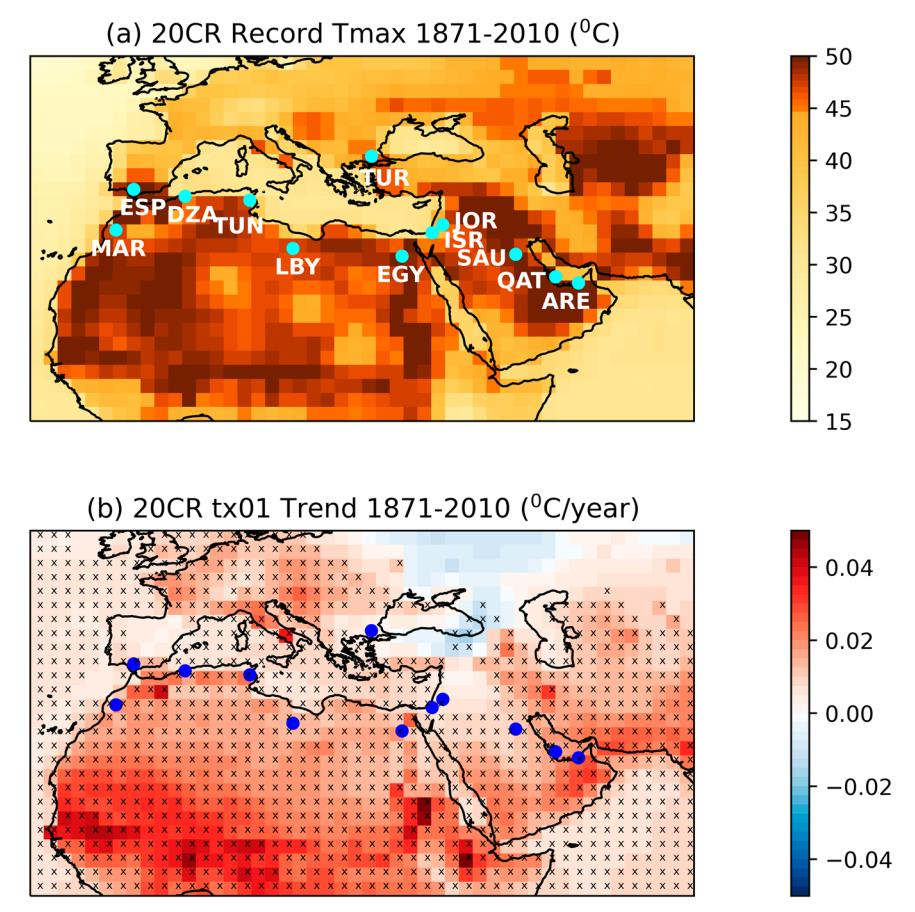
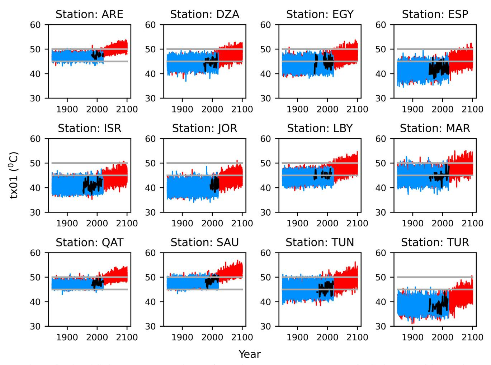
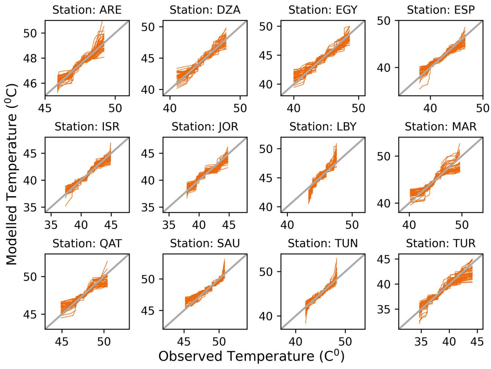
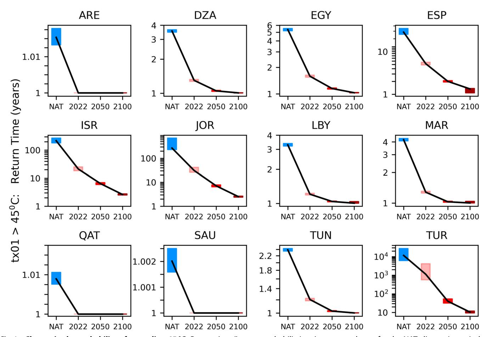
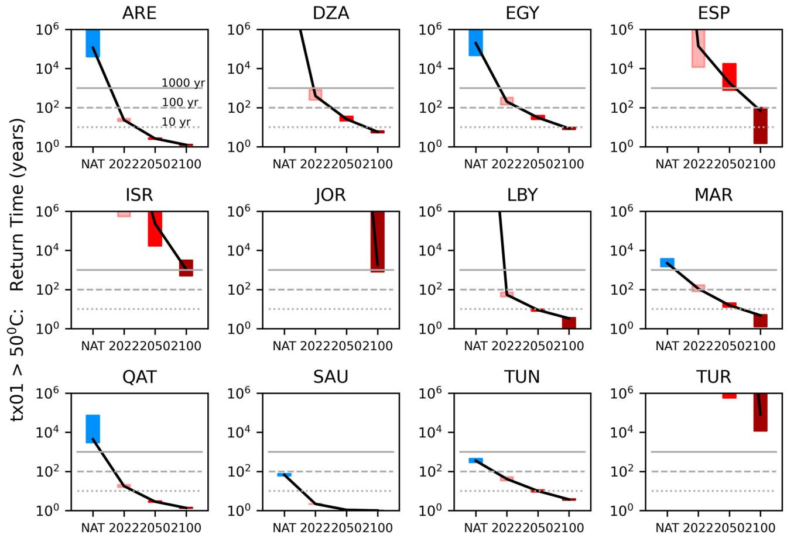
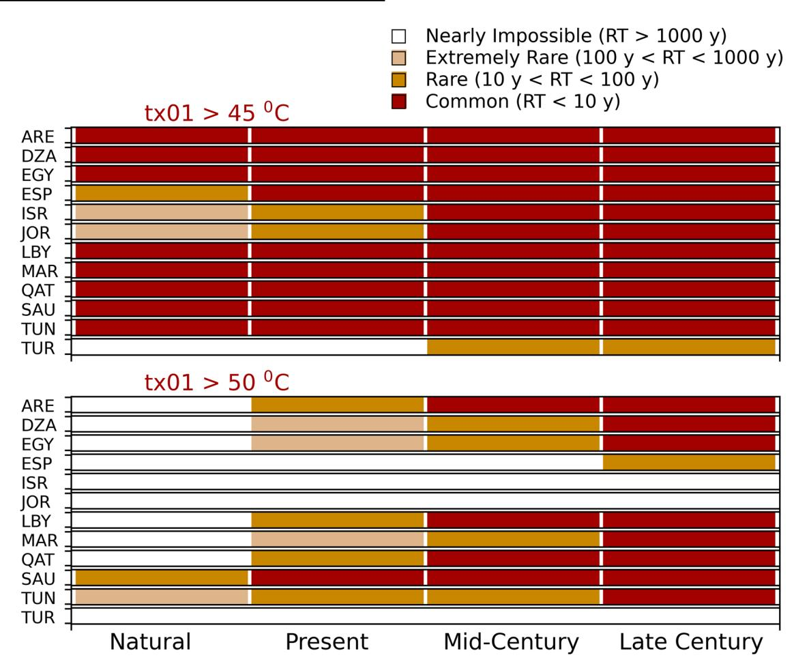
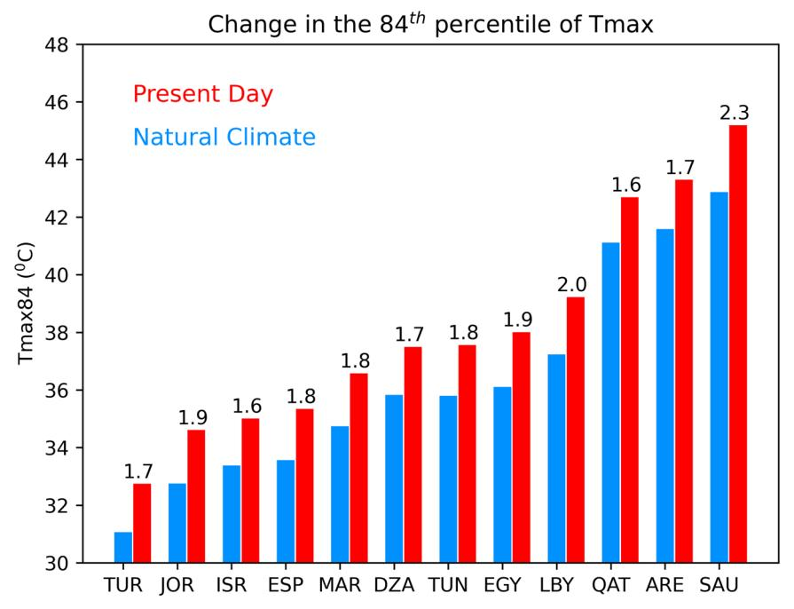
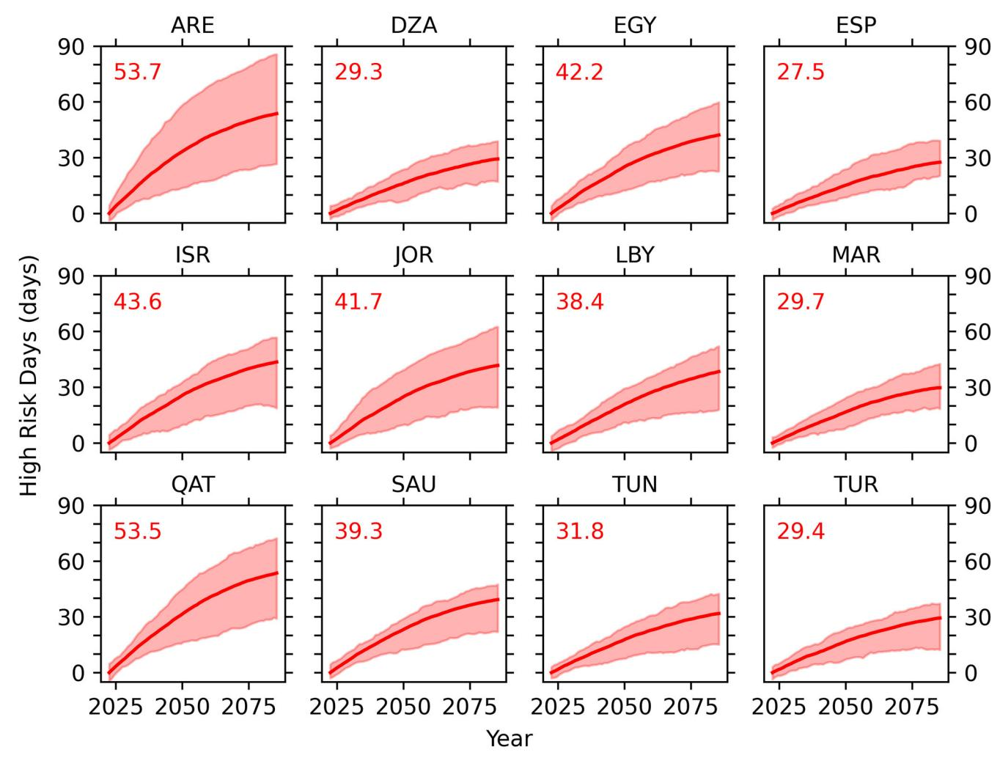

# ARTICLE OPEN

# Rapidly increasing likelihood of exceeding 50 °C in parts of the Mediterranean and the Middle East due to human influence

Nikolaos Christidis 1™, Dann Mitchell2 and Peter A. Stott1

As the world warms, extremely hot days are becoming more frequent and intense, reaching unprecedented temperatures associated with excess mortality. Here, we assess how anthropogenic forcings affect the likelihood of maximum daily temperatures above 50 °C at 12 selected locations around the Mediterranean and the Middle East. We adopt a risk-based attribution methodology that utilises climate model simulations with and without human influence to estimate the probability of extremes. We find that at all locations, temperatures above 50 °C would have been extremely rare or impossible in the pre-industrial world, but under human-induced climate change their likelihood is rapidly increasing. At the hottest locations we estimate the likelihood has increased by a factor of 10–10³, whereas by the end of the century such extremes could occur every year. All selected locations may see 1–2 additional months with excess thermal deaths by 2100, which stresses the need for effective adaptation planning.

npj Climate and Atmospheric Science (2023)6:45; https://doi.org/10.1038/s41612-023-00377-4

#### INTRODUCTION

The world has warmed by about a degree since the beginning of the 20th century and attribution research points to anthropogenic drivers as the dominant cause1 with greenhouse gas emissions as the major contributor to the warming2. The role of human influence is also evident in regional warming since the 1950s3, which, in turn, engenders an intensification of extreme heat episodes4,5 that put a strain on human and, more widely, ecosystem health6,7. Concern about the changing characteristics of weather and climate extremes propelled the science of event attribution8,9. A profusion of event studies have provided strong evidence that hot extremes around the world are becoming more frequent and intense as a result of anthropogenic climate change10. The pioneering work of Stott et al. (2004) that set the foundations of this new research area11, was motivated by the deadly European summer heatwave of 2003 that claimed the lives of 35,000–70,000 people12. Since then, further studies have shown how anthropogenic forcings influence not only heatwaves, but a range of different types of extremes, as well as climate change impacts13. Continuing warming is expected to further exacerbate risks, exposing billions of people to climatic conditions never experienced over the last 6000 years14. Our study aims to offer new insights into the looming reality of temperatures that would not only break new records, but also, in the absence of effective adaptation, could usher in calamitous socio-economic consequences. Dangerous temperature thresholds in terms of local impacts are sometimes easy to identify. For example, after reaching a record temperature of 38.7 °C in Cambridge in July 2019, the possibility of exceeding 40 °C in the UK, which would have been unthinkable a generation ago, began to appear within reach. An attribution study indeed confirmed that the chances of such an event are increasing so fast because of human influence, that it could become common by the end of the century15. Only two years after the study was published, a new UK record was set at 40.3 °C16. Recent studies have also affirmed that Europe needs to brace itself for summers hotter than 200317,18. Extreme heat poses greater challenges to communities that are more vulnerable because of their lower adaptive capacity. In Latin American cities, for example, it is estimated that nearly a million of deaths during 2002–2015 are linked to temperature extremes19. Even in hot countries like India, when one might expect the population is well-adapted to high temperatures, extreme heat still takes its toll. For example, during a persistent hot spell in Gujarat in May 2010, excess mortality was found to have increased by 43%20.

The raft of adverse impacts associated with extreme heat makes it imperative to understand how human climatic influences change their characteristics. The strong links between extremely high temperatures, a major contributor to heat stress, and excess mortality have been well-documented21,22. Such impacts are exacerbated in cities because of the urban heat island effect6. The increasing frequency of extremes would also lead to a shift in diseases23 Moreover, high temperatures have been shown to be detrimental to mental health24 and associated with an increase in the risk of suicide25. Excessive heat stress in hot ambient conditions has also been shown to reduce productivity and put a strain on occupational health26. Nevertheless, a billion outdoor workers are estimated to be exposed to extreme heat, with a third of them suffering ill health as a result6. As the climate continues to change, hotter regions are projected to bear most of the burden of heat-related health impacts in coming decades27. While the UK public is concerned about crossings of the 40 °C threshold28, hotter countries face the challenge of overshooting the more perilous threshold of 50 °C more frequently, or even for the first time in coming years. Here we use exceedances of the 50 °C threshold to characterise extremely high and potentially lifethreatening temperatures, which are projected to become more persistent and widespread over our reference region29, and which could affect up to half of its population by the end of the century30. It is estimated that under a global warming greater than 2 degrees, temperatures above 50 °C will be recorded in all continents except Antarctica, with maxima over the Arabic Peninsula31. Even in Europe the prospect of such extremes has become more palpable after the highest temperature of 48.8 °C was recorded in Sicily on 11 August 202132. On the other hand, the development of countries in the Arabian Gulf has already been factoring in summer temperatures that often rise above 50 °C33. In

the absence of any mitigation measures, model projections suggest that in the second half of this century heatwayes of unprecedented severity would begin to emerge in North Africa and the Middle East, characterised by exceedances of the 50 °C threshold30. In this study we take a step further and aim to quantify the changing likelihood of such threshold exceedances in selected locations in the Mediterranean area and the Middle East. In addition to 50 °C, we also consider exceedances of 45 °C, as a more suitable threshold for cooler locations, where exceeding 50 °C remains unlikely even in future decades. Our analysis distinguishes between the roles of human influence and internal climate variability and maps out in a quantitative manner the growing reality of severe heat, from the pre-industrial climate to the present-day and on to the end of the century. To estimate future probabilities, we adopt a medium emissions scenario that, unlike the business-as-usual pathway, recognises global adaptation and mitigation efforts and therefore serves as a better starting point34,35.

As an attribution study, our work focusses on the meteorological hazard component of extreme heat risk. In addition, the extent of associated impacts would also be determined by changes in the population, as well as its exposure to the hazard and its degree of vulnerability36–38. Here we employ a risk-based attribution framework39–41 to estimate the probability of extreme temperatures in 12 locations over 3 continents around the Mediterranean Basin and the Middle East. Although all locations are characterised by hot summers, they cover a range of temperature climatologies, with some already experiencing temperatures close to or above 50 °C and some not. Simulated data from experiments with and without the effect of human influence on the climate yield the probability estimates of extreme events. The modelled data come from an ensemble of 11 state-ofthe-art models that participated in the phase 6 of the Coupled Model Intercomparison Project (CMIP6)42 and are evaluated against station observations. Using data from the latest CMIP6 models we assess here for the first time how the climatological risk of high-impact extreme temperatures in the region changes under the influence of anthropogenic forcing. While keeping the focus on attribution, we also provide a complementary, albeit broad perspective on health impacts for the 12 locations, examining how anthropogenic warming might lead to longer periods of excess thermal deaths in the coming years. For this purpose, we use the High Risk Days (HRD) index, developed as a simple temperature-based metric for impact attribution studies,

which estimates the additional number of days relative to a reference climate when high temperatures are expected to lead to enhanced heat-related mortality43. Results from our analysis are presented in the next section. We first illustrate how the warmest day of the year (*tx01*) in the reference locations has been influenced by anthropogenic forcings and is projected to continue to change. As our attribution assessment is largely model-based, we also evaluate the models against observations to examine whether they can reliably represent historical temperatures. Changes in the likelihood of exceeding extreme thresholds due to human influence are presented next, followed by the assessment on health impacts using the HRD index. Finally, in the last section of the paper we summarise key results and discuss the significance and implications of our attribution study.

#### **RESULTS**

# Local changes in *tx01*: observations, reanalysis, and CMIP6 data

The sparse coverage of observation stations that provide data necessary for model evaluation, impedes attribution investigations of local extremes over large areas, meaning that most studies either consider larger spatial scales or only a specific location44. Here we select 12 locations in hotspot regions, where it seems reasonable to question whether maximum temperatures might rise above the thresholds of 45 or even 50 °C with an increasing frequency in a warming climate. We include locations in 12 different countries of three continents (hereafter referred to using the country ID code), for which station daily temperature data45 are available over several recent decades (Table 1). Maximum daily temperatures (Tmax) above 50 °C have already been recorded at two locations (QAT and SAU), with five more stations bordering on the threshold (Table 1). Our analysis employs the annual maximum daily temperature (tx01), i.e., a measure of the warmest day of the year, to examine year-to-year changes in local extremes. To understand how the local tx01 characteristics take shape within the context of larger spatial scales, we also employ data from the 20th Century Reanalysis (20CR)46,47 and examine historical changes in tx01 over a wider region and a much longer period compared to station observations. Reanalysis temperature records and trends over the period 1871–2010 are illustrated in Fig. 1. While only few European regions see records above 45 °C, such extremes are clearly manifest in Northern Africa, the Arabian Peninsula and other parts of the Middle East. Our reference locations sample a

| Table 1. Observation stations. |                      |               |             |                            |  |
|--------------------------------|----------------------|---------------|-------------|----------------------------|--|
| Country                        | Station name         | Coordinates   | Obs. period | Record Tmax temp °C (Year) |  |
| ARE (UA Emirates)              | ABU DHABI INTL       | 24.43N 54.65E | 1983–2021   | 49.2 (1999)                |  |
| DZA (Algeria)                  | ECH CHELIFF          | 36.21N 1.33E  | 1957-2021   | 48.0 (2015)                |  |
| EGY ( <i>Egypt</i> )           | MINYA                | 28.08N 30.73E | 1957-2021   | 48.6 (1992)                |  |
| ESP (Spain)                    | MORON DE LA FRONTERA | 37.16N 5.62W  | 1955-2021   | 46.6 (1967)                |  |
| ISR (Israel)                   | BEER SHEVA           | 31.25N 34.82E | 1951-2016   | 44.9 (2002)                |  |
| JOR (Jordan)                   | KING HUSSEIN         | 32.36N 36.26E | 1959-2021   | 44.8 (2010)                |  |
| LBY ( <i>Libya</i> )           | HON                  | 29.12N 15.95E | 1956-2021   | 47.6 (2010)                |  |
| MAR (Morocco)                  | MENARA               | 31.61N 8.04W  | 1957-2021   | 49.6 (2012)                |  |
| QAT (Qatar)                    | DOHA INTL            | 25.26N 51.56E | 1983-2021   | 50.4 (2010)                |  |
| SAU (Saudi Ar.)                | QAISUMAH             | 28.33N 46.12E | 1966-2021   | 50.8 (2007)                |  |
| TUN (Tunisia)                  | KAIROUAN             | 35.67N 10.10E | 1957–2021   | 48.3 (2018)                |  |
| TUR (Turkey)                   | EDIRNE               | 41.67N 26.57E | 1955-2021   | 44.1 (2007)                |  |

The table gives details of the 12 stations used in the study, including the country where they are located, the station name and coordinates, the observational period, and record daily maximum temperature for each location together with the year when it was observed (in parentheses). The locations of the stations are illustrated in Fig. 1.

**Fig. 1** Records and trends of the warmest day of the year in the 20CR reanalysis. a Map of the highest maximum daily temperature during 1871–2010. Darker colours correspond to temperatures higher that 45 °C. b Trends in the warmest day of the year (tx01) during the reanalysis period. Crosses mark areas where trends are significantly different from zero (tested at the 10% level), as determined by a Mann–Kendall test. When applying the Mann–Kendall test it is assumed that serial correlation has a minimal effect on the tx01 timeseries and is therefore not accounted for. The dots on the figure panels show the location of the 12 stations considered in the study.

range of *tx01* maxima, and include sites with relatively moderate extremes (in TUR, ISR, and JOR), where the current likelihood of hitting 50 °C appears to be near-zero, given the much cooler local records. An interesting question we aim to answer is whether such unprecedented temperature exceedances may become plausible at these locations in coming years. Trends computed with 20CR data reveal significant long-term warming in *tx01* over most of the wider region (Fig. 1b). The small cooling trends over parts of Eastern Europe and Western Asia are not statistically significant as confirmed with a Mann–Kendall test. The reanalysis suggests that *tx01* is on the rise at all reference locations, with an estimated warming rate between 0.5 and 2.5 °C per century.

Local tx01 estimates are also derived from CMIP6 simulations (Methods) that represent the natural climate, without the influence of anthropogenic forcings (NAT), and the actual world with all forcings acting on the climate system (ALL). We use 50 NAT and 46 ALL simulations from 11 different models that start in year 1850. The ALL simulations are extended to year 2100 following the "middle-of-the-road" emissions scenario SSP2-4.548. Local tx01 values correspond to the nearest model grid-box, an approximation that is found to work well for variables with large spatial correlation scales like temperature, away from densely built-up areas where urban warming also needs to be accounted for49. We therefore select only observation stations away from large urban centres, either in smaller towns or at airport sites outside the city boundaries, in order to minimise the effect of urbanisation. It should be stressed that our findings only apply to the specific locations considered here, and extreme event probabilities may indeed be higher in nearby cities. The approximation of local temperatures with grid-box data is also assessed in this study on the basis of the evaluation tests described later. A simple correction of the mean model bias relative to station observations is also applied to the simulated data (Methods). Timeseries of tx01 constructed with the ALL and NAT simulations and station observations are illustrated in Fig. 2. Although natural variability would mask to some extent the anthropogenic fingerprint, a warming trend has taken off in recent years in the ALL climate and is projected to intensify in future decades. Exceeding the 45 °C threshold is gradually becoming more common in cooler locations (e.g., TUR), but is already certain to be exceeded in hotter locations. In SAU, for example, average tx01 values are projected to reach 53 °C by the end of the century, rendering 50 °C a relatively low temperature. Despite regional variations in the likelihood of extremes, the CMIP6 ALL experiment simulates years with tx01 greater than 50 °C in all reference locations towards the end of the century, even those that are currently several degrees cooler and have not yet experienced such intense extremes.

#### Model evaluation

In common with other multi-model studies, we evaluate the ensemble of the 11 models as a whole against the station observations. While more detailed studies of extremes might evaluate various aspects of the simulated climate, like, for example, dynamical drivers, or land-atmosphere interactions, attribution analyses are primarily concerned with the ability of

Fig. 2 Observed and modelled tx01 timeseries at the 12 reference locations. Timeseries constructed with observational data are shown in black. Modelled timeseries from the 46 ALL and 50 NAT simulations provided by the CMIP6 models are shown in red and blue respectively. The grey horizontal lines mark the 45 and 50 °C thresholds. Location names are shown at the title of each panel.

the models to reliably represent the distribution of the reference variable from which event probabilities are derived. We therefore employ some popular tests that have been developed and tried over years in event attribution studies[15](#page-10-0),[50](#page-11-0) to examine whether main statistical characteristics of tx01 constructed with the multimodel ensemble are overall consistent with the observations. Comparing the modelled and observed variability, we find that the observed standard deviation (SD), linked to the scale of the distribution, is within the range of the models (Supplementary Fig. 1), with no model yielding systematically high or low SD values across the reference locations. Power spectra that assess variability over different timescales[51](#page-11-0) also show that the observations lie within the range of the models (Supplementary Fig. 2). We next construct quantile-quantile (Q-Q) plots for each model simulation (Fig. [3\)](#page-4-0), which broadly indicate the level of consistency between models and observations in representing different parts of the distribution (main body and tails). Again, we find no systematic discrepancy, but, on the contrary, a good level of agreement that is also the case for the warm tail of the distribution (higher tx01 values), pertinent to the representation of the likelihood of hot extremes. Finally, for each location, we apply a Kolmogorov-Smirnov test to compare observational tx01 estimates with a sample constructed by pooling together tx01 values from the 46 ALL simulations over the observational period. In all cases we find that the model-based distribution is indistinguishable from the observed one (p-value greater than 0.1). Despite sampling

limitations due to the short observational records, the evaluation assessments could still flag models that markedly depart from the rest of the ensemble range and, in our case, they provide reassurance that the multi-model ensemble is indeed fit for the purposes of an attribution analysis. It is also evident that local temperatures can be adequately represented by grid-box scale data with no indication of significant urban warming to render the modelled temperatures too cold.

# The probability of exceeding 45 and 50 °C

We next use the multi-model ALL and NAT ensembles to estimate probabilities of extreme events, defined as tx01 exceedances of a high temperature threshold. Our main interest is in exceedances of 50 °C, but we also consider the 45 °C threshold that is more relevant for hot extremes in cooler locations, at least without strong anthropogenic influence. The natural world probabilities are estimated from all simulated years of the NAT experiment, while present-day and future probabilities are derived from time slices of the ALL simulations. Details of our analysis are given in the Methods. As common in event attribution studies, we report return times of extreme events (inverse probabilities), measuring the average span between consecutive extremes under certain climatic conditions. Figure [4](#page-5-0) illustrates the change in the return time of years with tx01 above 45 °C (also Supplementary Table 2). In most locations the threshold is not particularly extreme and is exceeded every year, or every few years, even in the natural world.

Fig. 3 Evaluation of the modelled *tx01* distribution. Quantile–quantile (Q–Q) plots for each of the ALL simulations, comparing the modelled and the observed *tx01* distributions. Location names are shown at the title of each panel.

In the three cooler locations (ISR, JOR, TUR), however, such events are extremely rare in the NAT climate (return time of the order of centuries), but are becoming more common due to human influence and are estimated to occur at least once a decade by the end of the century. The changing return times for the 50 °C threshold are shown in Fig. 5 (also Supplementary Table 2). We find that reaching such extreme temperatures would be extremely rare or even impossible in the NAT climate. Even in the warmest SAU location, the estimated NAT return time is of the order of a century. Nevertheless, the likelihood is rapidly increasing due to anthropogenic forcings, with sub-century return times in today's climate computed at five of the reference locations. By the end of the century, a tx01 greater than 50 °C may be seen at least once a decade in most locations and could be exceeded annually at the warmest sites of ARE, QAT and SAU, where warm extremes are projected to reach unprecedented highs in the mid- or high- 50 s (Fig. 2). Interestingly, even at the relatively cooler station in ESP, where exceeding 50 °C never occurs in the NAT climate and is extremely rare up to the 2050 s, the likelihood increases at a fast pace, leading to return times of less than a century by 2100 (best estimate: 70 years). Similarly, such extremes that would not occur in the pre-industrial climate at LBY, could become common in coming decades. Although the likelihood remains extremely low at the three cooler locations (ISR, JOR, TUR), there are years towards the end of the century with some simulated temperatures above 50 °C, implying that, although extremely rare, these exceedances are not impossible. A summary plot of the temporal changes due to human influence is shown in Fig. 6, where extremes are categorised according to their likelihood into four groups (from nearly impossible to common). In contrast to the lower threshold, where less change is seen, exceedances of 50 °C at most locations swiftly transit through categories of increasing likelihood. Finally, risk ratio estimates are reported in Table 2, measuring the present and future increase in the likelihood of extreme events relative to the NAT climate. For the more moderate threshold of 45 °C, we compute lower risk ratios that may even reduce to unity at locations where this temperature is commonly exceeded even without anthropogenic warming. At the three cooler locations, human influence is estimated to have increased the likelihood by a factor of about ten, but risk ratios become much higher by the end of the century. For the 50 °C threshold we find that the risk ratio goes to infinity at sites with a near-zero likelihood of extreme events in the NAT climate, and estimate tens or hundreds of times higher probabilities at hotter locations, again with further increases in the future. Risk ratios of infinity are often reported in attribution studies10, suggesting that events that would have been effectively impossible without human emissions have become possible. The range of risk ratios reflects differences in the local climate. For example, temperatures above 50 °C without human influence are more common in SAU than ARE (Fig. 2), hence the effect of anthropogenic warming is more prominent in ARE (higher risk ratio).

Fig. 4 Change in the probability of exceeding 45 °C. Return time (inverse probability) estimates are shown for the NAT climate (green), the present-day (pink), the middle of the century (red) and the end of the century (dark red). The black line connects the best estimates (50th percentile) corresponding to the different climatic conditions and the coloured vertical bars mark the 5-95% uncertainty range. Location names are shown at the title of each panel.

## Increase in high risk days

As the health data required for a heat-mortality attribution analysis are not available for the countries considered here, we carry out a more general assessment of the expected increase in the severity and frequency of days with excess thermal deaths. In physiological terms, the "optimum temperature" (OT), or Minimum Mortality Temperature (MMT), describes the local comfort zone and sets the mortality baseline22,52. Excess deaths that occur when the temperature rises above, or falls below the OT are referred to as heat- and cold-related mortality. Non-optimum temperatures are estimated to account for almost 8% of all-cause mortality in selected locations22. Analysing mortality data in Japan and in 79 cities in three different continents with different climates, has demonstrated that the OT can be approximated by the 84th percentile of daily Tmax52,53. Even without explicitly accounting for the effect of humidity, no significant discrepancy was found between the OT and the 84th percentile in the cities examined. As the climate warms, the 84th percentile of Tmax also increases, and Fig. 7 illustrates the difference between its present-day and natural world values at the 12 locations considered in this study (Methods). This difference constitutes the "high risk warming" (HRW) index43 that measures the anthropogenic warming leading to an increase in thermal deaths, or the extra amount of warming that people need to adapt to relative to the NAT climate to counteract an increase in heat-related mortality. We find that the HRW index ranges between 1.6 and 2.3 °C at the reference locations. Moreover, the 84th percentile is much lower than 50°C (and even below 40 °C at most locations), suggesting that exceedances of such a high threshold could bring about large mortality spikes as they drive the population well-outside its comfort zone, in the absence of mitigating social factors. We next estimate the local "high risk days" (HRD) index that measures the change in the number of days above the 84th percentile of Tmax relative to a baseline climate43 (Methods). The HRD index is essentially a crude estimate of the additional days when thermal deaths are expected to occur because of anthropogenic warming. Here we set the baseline climate to present-day to examine future increases in risk relative to today's climate. Alternatively, the baseline could be set to the NAT climate, or any period relative to which one wants to assess the anthropogenic increase in the frequency of excess mortality43. Figure 8 shows timeseries of the HRD index from present-day to the end of the century. Our analysis suggests an index increase of about 1-2 months (best estimate) at all regions. This estimate suggests that the reference locations are set to experience several more weeks of oppressive heat in coming decades, though the actual number of excess deaths would also depend on other meteorological factors like humidity, as well as socio-economic aspects related to how well communities are prepared to adapt to new climatic conditions where extreme heat episodes become more frequent.

# **DISCUSSION**

Understanding the changing characteristics of extreme events under the influence of anthropogenic climate change provides a solid scientific basis for the planning of effective adaptation and

Fig. 5 Change in the probability of exceeding 50 °C. Return time (inverse probability) estimates are shown for the NAT climate (green), the present-day (pink), the middle of the century (red) and the end of the century (dark red). The black line connects the best estimates (50th percentile) corresponding to the different climatic conditions and the coloured vertical bars mark the 5-95% uncertainty range. The grey horizontal lines mark the 1000 years (solid), 100 years (dashed), and 10 years (dotted) return time values. Location names are shown at the title of each panel.

mitigation policies. Changes in the climate of the reference region54 with increases in extremely high temperatures over coming decades55 have been highlighted before in the literature. Our attribution analysis demonstrates how the frequency of maximum temperatures above 50 °C is rapidly increasing in parts of the Mediterranean and the Middle East. Such extreme temperatures could be considered commonplace by the end of the century at locations where they are still very rare and would not have occurred in the pre-industrial world. As the hottest European temperatures already verge on 50 °C, the question arises whether extreme climatic conditions similar to neighbouring regions like Northern Africa are migrating into Europe. Our work provides some evidence that this may indeed be the case, at least in areas with the largest warming trends like Southern Spain. Although this northward climate migration is perhaps an unsurprising scientific inference, its associated unprecedented impacts are of great importance to affected European countries. Even at the hottest locations examined here, where temperatures above 50 °C have already been observed, human influence is found to have increased their likelihood by a factor of ten or more. Of course, like all scientific studies, our analysis has its limitations. Our multi-model ensemble is tied to the available simulations from models that make unequal contributions to it. However, such an "ensemble of opportunity", as often referred to, although not perfectly constructed, can still provide an indicative measure of the modelling uncertainty. Results are also very much dependent on the experimental design, e.g., the choice of the future emissions pathway, or the selected locations. The likelihood of extremes is indeed expected to vary considerably within a country due to regional climatic variations, urbanisation, etc, and the selected sites offer only a limited, yet instructive, perspective on the overall regional response to climate change. Our study considers only one specific region where local exceedances of 50 °C are shown to occur with an increasing frequency, but, given sufficient data availability, future work may extend it to other hotspot regions like South Asia, Central America, or Australia. On the side of impacts, we find a marked increase in days with excess mortality due to anthropogenic warming, though more focussed follow-up studies are necessary to establish how the combination of meteorological variables would influence lethal heat56, or assess the important roles of exposure, population growth and adaptive capacity6.

The increasing risk of population exposure to unprecedented temperatures has profound implications. It has already been pointed out that parts of the Persian Gulf and the wider Middle East are on the brink of experiencing heatstress too severe for human tolerance57,58, calling for urgent action to ensure high-risk areas remain inhabitable. There are also concerns that in Gulf countries with a booming building industry, construction workers are particularly vulnerable to extreme heat 59,60, but associated heat illnesses and deaths may be underreported (https:// www.bbc.co.uk/news/av/world-middle-east-61711468). Preventive measures in these countries ban outdoor work at certain hours during the hottest months, but still cannot guarantee workers will

Fig. 6 Temporal changes in the likelihood of extremes under the influence of anthropogenic forcings. The likelihood (best estimate) of exceeding 45 °C (top) and 50 °C (bottom) in the natural climate, the present-day, the middle of the century, and the end of the century is grouped into four categories based on the return time. The horizontal rows correspond to the reference locations and each likelihood category is represented by a different colour.

| Table 2. Location | Risk ratio: T > 45 °C |                    |                   | Risk ratio: T > 50 °C  |  |  |
|----------------------|-----------------------|--------------------|-------------------|------------------------|--|--|
|                      | Present day           | End of the century | Present day       | End of the century     |  |  |
| ARE                  | 1                     | 1                  | 4845 (1678–44775) | >104                   |  |  |
| DZA                  | 2.73 (2.66–2.83)      | 3.53 (3.44–3.62)   | >105 (4644 - inf) | >105                   |  |  |
| EGY                  | 3.37 (3.23–3.52)      | 5.19 (5.03–5.36)   | 976 (196–18373)   | >104 (5352 - >105 ) |  |  |
| ESP                  | 5.54 (4.66–6.87)      | 22 (19–29)         | inf               | inf                    |  |  |
| ISR                  | 10 (8–13)             | 82 (69–104)        | inf               | inf                    |  |  |
| JOR                  | 9 (6–23)              | 107 (91–283)       | inf               | inf                    |  |  |
| LBY                  | 2.72 (2.64–2.82)      | 3.26 (3.16–3.36)   | inf               | inf                    |  |  |
| MAR                  | 3.28 (3.17–3.41)      | 4.19 (4.02–4.32)   | 20 (11–36)        | 469 (316–1498)         |  |  |
| QAT                  | 1                     | 1                  | 250 (164–3984)    | 3231 (2228–52711)      |  |  |
| SAU                  | 1                     | 1                  | 31 (27–34)        | 66 (60–74)             |  |  |
| TUN                  | 1.98 (1.93–2.03)      | 2.38 (2.34–2.42)   | 8 (6–12)          | 95 (78–120)            |  |  |
| TUR                  | 10 (2–32)             | 1128 (574–2617)    | inf               | inf                    |  |  |

Estimated change in the probability of exceeding 45 and 50 °C at the reference locations.

Best estimates (50th percentile) of the risk ratio are reported together the 5–95% uncertainty range in parentheses (no range is given when estimated to be near-zero, or all percentiles are of the order of several thousand years).

**Fig. 7 High-risk warming.** Estimates of the 84th percentile of Tmax at the 12 reference locations estimated with data from the CMIP6 experiments for the NAT climate (green) and the present-day climate (red). The increase in the 84th percentile that represents the warming of the pre-industrial OT temperature due to human influence is also marked on the plot for each location.

not be exposed to dangerously high temperatures. It is therefore essential that scientific information is not only communicated to stakeholders, but also integrated into the process of decisionmaking. Adaptation and public health planning, which has so far been largely reactive61, may call for changes in the built environment, efforts to raise public awareness, or improve healthcare readiness. Such steps become urgent in light of the ominous intensification of deadly heat and need to be taken in a way that would not widen the disparity between the poor and the rich. For example, air-conditioning is an effective resilience measure to heat mitigating up to 20% of heat-related mortality. While it is ubiquitous in wealthier countries like Qatar and has now begun to feature in outdoor spaces (https://www.washingtonpost.com/ graphics/2019/world/climate-environment/climate-change-qatarair-conditioning-outdoors/), it may still be considered a luxury among poorer countries, or the underprivileged, who are likely to bear the brunt of climate change impacts. Finally, alongside socioeconomic adaptation, longer term mitigation action is also necessary to ensure communities will not be pushed beyond survival limits.

# **METHODS**

# Computing tx01 with CMIP6 data

We use daily Tmax data from attribution experiments62 with a multi-model ensemble of 11 CMIP6 models to compute *tx01* values for every simulated year. The *tx01* is a popular index in climate change studies, describing annual events with more robust statistical properties than alternative extreme indicators of rarer events that lie into the far tail of the temperature distribution and are thus more poorly sampled. Details on the CMIP6 models can be found in the latest report of the Intergovernmental Panel on Climate Change (IPCC) by Working Group I63 and references therein. CMIP6 models have been used to investigate temperature changes in the reference region64–66 and shown to perform better than the previous generation of climate models67. Following a risk-based attribution framework, we compare simulations with

(ALL) and without (NAT) human influence on the climate. The NAT experiment includes natural forcings only (changes in volcanic aerosols and in the solar irradiance), whereas the ALL experiment also includes the effect of anthropogenic forcings (changes in greenhouse gases, aerosols, ozone and land use). The NAT simulations span the period 1850-2020, while the ALL simulations, that also start in 1850, are extended to year 2100 with the "middle of the road" Shared Socioeconomic Pathway 2 4.5 (SSP2 4.5)48. We select models that provide both ALL and NAT simulations, and, for each experiment, we limit the number of simulations to ten per model to minimise biases towards models with larger ensembles. We also exclude two models that fail the evaluation tests against observations and have considerable data gaps. Given all the selection requirements, the ALL and NAT ensembles used in this study include 46 and 50 simulations respectively (Supplementary Table 1). Two main advantages of using multi-model ensembles are that a) they provide large samples for the estimation of small probabilities associated with extreme events which reduces the statistical uncertainty, and b) they account for model uncertainties as opposed to single-model analyses. Values of tx01 at the location of each observation station (Table 1) are computed for all simulated years using the daily Tmax data at the grid-point nearest to the station. Local temperatures may indeed be well approximated by modelled grid-box scale temperatures, as long as they are not heavily influenced by urban warming. For example, data from a CMIP6 multi-model ensemble similar to this study have been shown to represent well temperatures at the station of Kameoka in the suburbs of Kyoto, but require a correction to account for the urban warming that underlines recorded temperatures at Kyoto's city centre 49. Grid-point data have also served as a local proxy for different types of meteorological variables68. Finally, as in previous work15, a simple bias-correction was applied to the modelled estimates of tx01 to ensure they have the same mean over the observational period as the station data. The use of mean bias-correction, or, alternatively, of anomalies relative to a baseline period, is common in attribution studies and necessary to compare or combine different datasets. A bias estimate is derived for each model by subtracting the mean

Fig. 8 Increase in high-risk days during the course of the century. Timeseries of the HRD index representing the additional days in a year with excess heat-related mortality relative to the present-day because of anthropogenic warming. The thick red line corresponds to the ensemble mean of the ALL simulations and the pink shaded area marks the 5–95% uncertainty range. The ensemble mean value at the end of the century is also marked on each panel. Location names are shown at the title of each panel.

observed from the mean modelled *tx01* over the observational period and is subsequently removed from all the *tx01* values (both ALL and NAT) simulated by the same model.

## **Probability calculation**

The likelihood of extreme events, defined as a tx01 exceedance of 45 or 50 °C, is estimated in the NAT and the present-day climate, as well as the future climate of the mid- and late 21st century under SSP2 4.5. The NAT climate is largely stationary, and we therefore use a sample of all tx01 values simulated by the NAT experiment, namely a total of 8550 values (50 simulations × 171 years in period 1850-2020). The large sample size has the advantage of reducing the sampling uncertainty in estimates of very small extreme probabilities. To account for non-stationarities in the warming ALL climate, we extract tx01 data from timewindows that represent the climate in different points in time15. More specifically, we utilise tx01 data in 30-year long periods centred on 2022 and 2050 for the present-day and mid-century climate respectively, and in the last 30 years of the extended ALL simulations for the late century climate. We thus obtain samples of 1380 values in total (46 simulations ×30 years) from which we estimate the likelihood of extreme events. Although the ALL samples are smaller than in the case of NAT, the associated

increase in the sampling uncertainty is, at least partly, compensated by the fact that event probabilities become higher (and so less uncertain) in a warming world. We compute extreme event probabilities by fitting a Generalised Extreme Value (GEV) distribution to the simulated data9, a parametric fit commonly applied to estimate probabilities of block maxima extremes 10. The fit is applied to the 8550 tx01 values of the NAT and 1380 values of the ALL experiment to quantify the NAT and ALL probabilities. The uncertainty in the probabilities comes from a Monte Carlo bootstrap procedure 15 that resamples the tx01 data 1000 times and derives new probability, or return time (inverse probability), estimates from the resampled data. In our study we report the best estimate of the return time, corresponding to the 50th percentile, as well as the 5-95% uncertainty range. The 50th, 5th and 95th percentiles defining the best estimate and the associated uncertainty range are thus computed from samples of 1000 possible values of the return time from the bootstrap procedure. The risk ratio that quantifies the change in the likelihood of extreme events because of human influence, is computed simply by dividing the probability of extreme events in the ALL climate by the probability in the NAT climate. As we have multiple estimates of the ALL and NAT probabilities, we get multiple estimates of the risk ratio for the uncertainty calculation.

#### **Heat-related mortality indicators**

The change in the 84th percentile of Tmax relative to the NAT climate, defined as the HRW index43, is indicative of the additional level of warming that people need to adapt to, so that today's warmer 84th percentile becomes the new OT. It should be noted that the HRW is not a direct measure of the additional deaths in the warmer climate, although higher HRW values are indicative of higher heat-related mortality. We compute the 84th percentile of the natural climate at each location from the Tmax data provided by the NAT simulations. For today's climate, the percentile is calculated from the Tmax data provided by the ALL simulations in the timewindow 2008–2037. In order to estimate the actual temperature that the 84th percentile corresponds to, the mean bias is removed for each model, using the same correction method applied to *tx01*.

The changing frequency of days when heat-related mortality is expected to occur is measured with the HRD index43. If  $N^i$  denotes the number of hot days in year i with Tmax above the  $84^{th}$  percentile of a baseline period, and  $N^{base}$  the average number of hot days in baseline years, then

$$HRD = N^i - N^{base}. (1)$$

By definition, an average baseline year should have about 58 days (0.16  $\times$  365) with Tmax higher than the 84th percentile (a proxy of the OT). The HRD index is a basic measure of the additional number of days that people need to adapt to because of the human-induced warming since the baseline period. Here we set the baseline to the present-day climate represented by years 2008-2037, for which we have already calculated the 84th percentile, as explained earlier. Previous work showed that different baselines can also be employed to represent different levels of adaptation, although the change of baseline does not markedly change future HRD estimates43. To calculate the HRD in future years and construct the timeseries in Fig. 8, we use simulated Tmax data in 30-year rolling windows and compute Ni for the central year i as the average annual number of days with Tmax above the baseline (present-day) OT. We so construct timeseries for each of the ALL simulations and plot the ensemble mean and the 5-95% uncertainty range derived from the ensemble spread. Note that as the HRD comes from the difference between two metrics that have the same mean bias, there is no need to apply a bias-correction in this case.

#### **DATA AVAILABILITY**

GHCN-D station observations of maximum daily temperature were retrieved from WMO's Climate Explorer at http://climexp.knmi.nl/selectdailyseries.cgi. 20CR data are available from https://psl.noaa.gov/data/gridded/data.20thC\_ReanV2.html. The CMIP6 simulated data used in the study are available from the Earth System Grid Federation (ESGF) Archive, https://esgf.llnl.gov/.

#### **CODE AVAILABILITY**

Code used for the analysis is available upon reasonable request.

Received: 19 October 2022; Accepted: 16 May 2023; Published online: 26 May 2023

# **REFERENCES**

- Eyring, V. et al. Human influence on the climate system. Chapter 3. In Climate change 2021: the physical science basis, 423–552 (Cambridge University Press, 2021).
- Gillett, N. P. et al. Constraining human contributions to observed warming since the pre-industrial period. *Nat. Clim. Change* 11, 207–212 (2021).
- 3. Doblas-Reyes, F. J. et al. Linking global to regional climate change. Chapter 10. In *Climate change 2021: the physical science basis*, 1363–1512 (Cambridge University Proc. 2021)

- Seneviratne, S. I., Donat, M., Mueller, B. & Alexander, L. V. No pause in the increase of hot temperature extremes. *Nat. Clim. Change* 4, 1513–1766 (2014).
- Fischer, E. M. & Knutti, R. Anthropogenic contribution to global occurrence of heavy-precipitation and high-temperature extremes. *Nat. Clim. Change* 5, 560–564 (2015)
- 6. Ebi, K. L. et al. Hot weather and heat extremes: health risks. Lancet 398, 698-708 (2021).
- Stillman, J. H. Heat waves, the new normal: summertime temperature extremes will impact animals, ecosystems, and human communities. *Physiology* 34, 86–100 (2019).
- National Academies of Sciences, Engineering, and Medicine. Attribution of Extreme Weather Events in the Context of Climate Change, 186 pp (The National Academies Press, 2016).
- Stott, P. A. et al. Attribution of extreme weather and climate-related events. WIREs Clim. Change 7, 23–41 (2016).
- Seneviratne, S. I. et al. (2021) Weather and climate extreme events in a changing climate. Chapter 11. In Climate change 2021: the physical science basis, 1363–1512 (Cambridge University Press, 2021)
- Stott, P., Stone, D. & Allen, M. Human contribution to the European heatwave of 2003. Nature 432, 610–614 (2004).
- 12. Robine, J.-M. et al. Death toll exceeding 70,000 in Europe during the summer of 2003. *Comptes Rendus Biologies* **331**, 171–178 (2008).
- Carbon Brief. Mapped: How climate change affects extreme weather around the world., https://www.carbonbrief.org/mapped-how-climate-change-affectsextreme-weather-around-the-world/ (2022).
- Xu, C., Kohler, T. A., Lenton, T. M. & Sceffer, M. Future of the human climate niche. Proc. Natl Acad. Sci. 117, 11350–11355 (2020).
- Christidis, N., McCarthy, M. & Stott, P. A. The increasing likelihood of temperatures above 30 to 40 °C in the United Kingdom. Nat. Commun. 11, 3093 (2020).
- Vaughan, A. Temperature hits 40 °C on the UK's hottest day on record, 3396 (New Scientist, 2022).
- Christidis, N., Jones, G. S. & Stott, P. A. Dramatically increasing chance of extremely hot summers since the 2003 European heatwave. *Nat. Clim. Change* 5, 46–50 (2015).
- Leach, N. J. et al. Anthropogenic influence on the 2018 summer warm spell in Europe: the impact of different spatio-temporal scales. *Bull. Am. Meteorol. Soc.* 101, S41–S46 (2020).
- Kephart, J. L. et al. City-level impact of extreme temperatures and mortality in Latin America. Nat. Med. 28, 1700–1705 (2022).
- Azhar, G. S. et al. Heat-related mortality in India: excess all-cause mortality associated with the 2010 Ahmedabad heat wave. PLOS One 9, e109457 (2014).
- Giorgini, P. et al. Climate changes and human health: a review of the effect of environmental stressors on cardiovascular diseases across epidemiology and biological mechanisms. Curr. Pharm. Des. 23, 3247–3261 (2017).
- Gasparrini, A. et al. Mortality risk attributable to high and low ambient temperature: a multicountry observational study. *Lancet* 386, 369–375 (2015).
- 23. Epstein, P. R. Is global warming harmful to health? *Sci. Am.* **283**, 50–57 (2001).
- Thompson, R., Hornigold, R., Page, L. & Waite, T. Associations between high ambient temperatures and heat waves with mental health outcomes: a systematic review. *Public Health* 161, 171–191 (2018).
- 25. Kim, Y. et al. Suicide and ambient temperature: a multi-country multicity study. *Environ. Health Perspect.* **127**, 117007 (2019).
- Pogačar, T. et al. The effect of hot days on occupational heat stress in the manufacturing industry: implications for workers' well-being and productivity. Int. J. Biometeorol. 62, 1251–1264 (2018).
- Zhao, Q. et al. Global, regional, and national burden of mortality associated with non-optimal ambient temperatures from 2000 to 2019: a three-stage modelling study. *Lancet Planet. Health* 5, e415–e425 (2021).
- Mitchell, D. M. & Lo, Y. T. E. Downplaying the catastrophic health impact of heatwaves costs lives. BMJ 378, o1940 (2022).
- Lelieveld, J. et al. Strongly increasing heat extremes in the Middle East and North Africa (MENA) in the 21st century. Clim. Change 137, 245–260 (2016).
- Zittis, G. et al. Business-as-usual will lead to super and ultra-extreme heatwaves in the Middle East and North Africa. npj Clim. Atmos. Sci. 4, 20 (2021).
- Suarez-Gutierrez, L., Müller, W. A., Li, C. & Marotzke, J. Hotspots of extreme heat under global warming. Clim. Dyn. 55, 429–447 (2020).
- Le Page, M. Sicily hits 48.8 °C, the highest temperature ever recorded in Europe (New Scientist. 2021).
- Kim, B. K. & Jeong, Y. H. High cooling water temperature effects on design and operational safety of NPPS in the Gulf region. *Nucl. Eng. Technol.* 45, 961–968 (2013). (2013).
- Fricko, O. et al. The marker quantification of the Shared Socioeconomic Pathway
  A middle-of-the-road scenario for the 21st century. Glob. Environ. Change 42, 251–267 (2017).
- 35. Hausfather, Z. & Peters, G. P. Emissions the 'business as usual' story is misleading. *Nature* **577**, 618–620 (2020).

- 36. Liu, Z. et al. Global and regional changes in exposure to extreme heat and the relative contributions of climate and population change. Sci. Rep. 7, 43909 (2017).
- 37. Rohat, G. et al. Influence of changes in socioeconomic and climatic conditions on future heat-related health challenges in Europe. Glob. Planet. Change 172, 45–59 (2019).
- 38. Romanello, M. et al. The 2021 report of the Lancet Countdown on health and climate change: code red for a healthy future. Lancet 398, 1619–1662 (2021).
- 39. Stott, P. A. et al. Attribution of weather and climate-related extreme events. Climate Science for Serving Society: Research, Modelling and Prediction Priorities, pp 307–337 (Springer Dordrecht, 2013).
- 40. Stone, D. A. et al. Experiment design of the International CLIVAR C20C+ detection and attribution project. Weather Clim. Extremes 24, 100206 (2019).
- 41. Christidis, N., Ciavarella, A. & Stott, P. A. Different ways of framing event attribution questions: the example of warm and wet winters in the United Kingdom similar to 2015/16. J. Clim. 31, 4827–4845 (2018).
- 42. Eyring, V. et al. Overview of the Coupled Model Intercomparison Project Phase 6 (CMIP6) experimental design and organization. Geosci. Mod. Dev. 9, 1937–1958 (2016).
- 43. Christidis, N., Mitchell, D. & Stott, P. A. Anthropogenic climate change and heat effects on health. Int. J. Climatol. 39, 4751–4768 (2019).
- 44. Angélil, O. et al. On the nonlinearity of spatial scales in extreme weather attribution statements. Clim. Dyn. 50, 2739–2752 (2018).
- 45. Menne, M. J., Durre, I., Vose, R. S., Gleason, B. E. & Houston, T. G. An overview of the Global Historical Climatology Network-Daily database. J. Atmos. Ocean. Technol. 29, 897–910 (2012).
- 46. Compo, G. P. et al. The Twentieth Century Reanalysis Project. Q. J. Roy. Meteorol. Soc. 137, 1–28 (2011).
- 47. Slivinski, L. C. et al. Towards a more reliable historical reanalysis: improvements for version 3 of the Twentieth Century Reanalysis system. Q. J. Roy. Meteorol. Soc. 145, 2876–2908 (2019).
- 48. Riahi, K. et al. The Shared Socioeconomic Pathways and their energy, land use, and greenhouse gas emissions implications: an overview. Glob. Environ. Change 42, 153–168 (2017).
- 49. Christidis, N., Aono, Y. & Stott, P. A. Human influence increases the likelihood of extremely early cherry tree flowering in Kyoto. Env. Res. Lett. 17, 054051 (2022).
- 50. Vautard, R. et al. Evaluation of the HadGEM3-A simulations in view of detection and attribution of human influence on extreme events in Europe. Clim. Dyn. 52, 1187–1210 (2019).
- 51. Gillett, N., Allen, M. R. & Tett, S. F. B. Modelled and observed variability in atmospheric vertical temperature structure. Clim. Dyn. 16, 49–61 (2000).
- 52. Honda, Y., Kabuto, M., Ono, M. & Uchiyama, I. Determination of optimum daily maximum temperature using climate data. Environ. Health Prev. Med. 12, 209–216 (2007).
- 53. Honda, Y. et al. Heat-related mortality risk model for climate change impact projection. Environ. Health Prev. Med. 19, 56–63 (2014).
- 54. Almazroui, M. et al. Spring Saharan cyclones over Saudi Arabia: preliminary study of the impacts on climate. Earth Syst. Environ. 3, 153–171 (2019).
- 55. Ntoumos, A. et al. Projected air temperature extremes and maximum heat conditions over the Middle-East-North Africa (MENA) region. Earth Syst. Environ. 6, 343–359 (2022).
- 56. Mora, C. et al. Global risk of deadly heat. Nat. Clim. Change 7, 501–506 (2017).
- 57. Freychet, N. et al. Robust increase in population exposure to heat stress with increasing global warming. Environ. Res. Lett. 17, 064049 (2022).
- 58. Raymond, C., Matthews, T. & Horton, R. M. The emergence of heat and humidity too severe for human tolerance. Sci. Adv. 6, eaaw1838 (2020). 2020.
- 59. Xiang, J., Bi, P., Pisaniello, D. & Hansen, A. Health impacts of workplace heat exposure: an epidemiological review. Ind. Health 52, 91–101 (2014).
- 60. Morioka, I., Miyai, N. & Miyashita, K. Hot environment and health problems of outdoor workers at a construction site. Ind. Health 44, 474–480 (2006).
- 61. Howard, S. & Krishna, G. How hot weather kills: the rising public health dangers of extreme heat. BMJ 378, o1741 (2022).
- 62. Gillett, N. P. et al. The Detection and Attribution Model Intercomparison Project (DAMIP v1.0) contribution to CMIP6. Geosci. Model Dev. 9, 3685–3697 (2016).

- 63. Chen, D. et al. (2021) Framing, context, and methods. Chapter 1. In Climate change 2021: the physical science basis, 147–286 (Cambridge University Press, 2021).
- 64. Almazroui, M. et al. Future changes in climate over the Arabian Peninsula based on CMIP6 multimodel simulations. Earth Syst. Environ. 4, 611–630 (2020).
- 65. Almazroui, M. et al. Projected change in temperature and precipitation over Africa from CMIP6. Earth Syst. Environ. 4, 455–475 (2020).
- 66. Almazroui, M. et al. Projected changes in climate extremes using CMIP6 simulations over SREX regions. Earth Syst. Environ. 5, 481–497 (2021).
- 67. Hamed, M. M., Nashwan, M. S., Shiru, M. S. & Shahid, S. Comparison between CMIP5 and CMIP6 models over MENA region using historical simulations and future projections. Sustainability 14, 10375 (2022).
- 68. Liu, Z., Eden, J. M., Dieppois, B., Conradie, W. S. & Blackett, M. The April 2021 Cape Town wildfire: has anthropogenic climate change altered the likelihood of extreme fire weather? Bull. Amer. Meteor. Soc. 104, E298–E304 (2023).

#### ACKNOWLEDGEMENTS

N.C. and P.A.S. were supported by the Met Office Hadley Centre Climate Programme funded by BEIS.

#### AUTHOR CONTRIBUTIONS

N.C. organised the research and carried out the analysis. D.M. and P.A.S. helped design the study and contributed to the discussion of results. N.C. wrote the paper with the help of all co-authors.

#### COMPETING INTERESTS

The authors declare no competing interests.

#### ADDITIONAL INFORMATION

Supplementary information The online version contains supplementary material available at <https://doi.org/10.1038/s41612-023-00377-4>.

Correspondence and requests for materials should be addressed to Nikolaos Christidis.

Reprints and permission information is available at [http://www.nature.com/](http://www.nature.com/reprints) [reprints](http://www.nature.com/reprints)

Publisher's note Springer Nature remains neutral with regard to jurisdictional claims in published maps and institutional affiliations.

Open Access This article is licensed under a Creative Commons Attribution 4.0 International License, which permits use, sharing,

adaptation, distribution and reproduction in any medium or format, as long as you give appropriate credit to the original author(s) and the source, provide a link to the Creative Commons license, and indicate if changes were made. The images or other third party material in this article are included in the article's Creative Commons license, unless indicated otherwise in a credit line to the material. If material is not included in the article's Creative Commons license and your intended use is not permitted by statutory regulation or exceeds the permitted use, you will need to obtain permission directly from the copyright holder. To view a copy of this license, visit [http://](http://creativecommons.org/licenses/by/4.0/) [creativecommons.org/licenses/by/4.0/](http://creativecommons.org/licenses/by/4.0/).

© Crown 2023