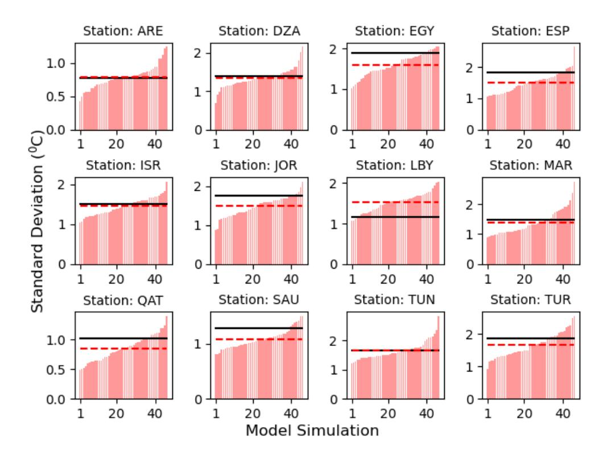
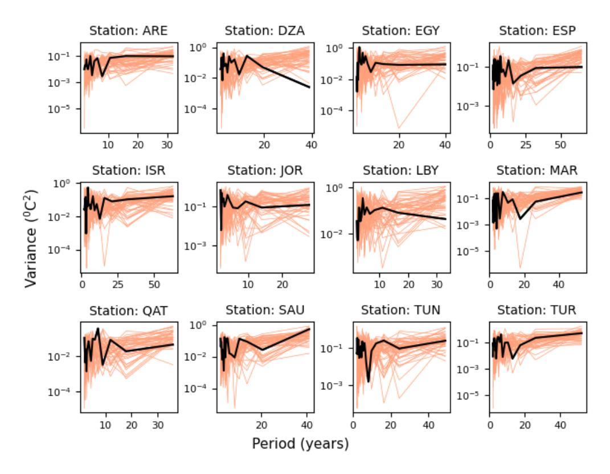

## *S u p p l e m e n t a r y I n f o r m a t i o n*

## **Rapidly increasing likelihood of exceeding 50 °C in parts of the Mediterranean and the Middle East due to human influence**

Nikolaos Christidis1\* , Dann Mitchell2 , Peter A Stott1

1Met Office Hadley Centre, FitzRoy Road, Exeter, EX1 3PB, United Kingdom

## \*Corresponding Author:

Nikolaos Christidis

Met Office Hadley Centre, FitzRoy Road, Exeter, EX1 3PB, United Kingdom

Tel: +44 (0) 330 135 1922

Email: [nikos.christidis@metoffice.gov.uk](mailto:nikos.christidis@metoffice.gov.uk)

2University of Bristol, University Road, Clifton, Bristol, BS8 1SS, United Kingdom

**Supplementary Table 1.** The CMIP6 models used in the attribution analysis. The table reports the number of simulations with (ALL) and without (NAT) the effect of human influence that each model provides. The ALL simulations are extended to year 2100 with the SSP2 4.5 scenario.

|    | Model         | ALL + SSP2 4.5 | NAT |
|----|---------------|----------------|-----|
| 1  | ACCESS-CM2    | 3              | 3   |
| 2  | ACCESS-ESM1-5 | 10             | 3   |
| 3  | BCC-CSM2-MR   | 1              | 3   |
| 4  | CNRM-CM6-1    | 1              | 3   |
| 5  | CanESM5       | 10             | 10  |
| 6  | FGOALS-g3     | 3              | 3   |
| 7  | GFDL-ESM4     | 1              | 1   |
| 8  | IPSL-CM6A-LR  | 10             | 6   |
| 9  | MIROC6        | 3              | 10  |
| 10 | MRI-ESM2-0    | 1              | 5   |
| 11 | NorESM2-LM    | 3              | 3   |
|    | TOTAL         | 46             | 50  |

**Supplementary Figure 1.** Modelled and observed *tx01* standard deviation. Standard deviation estimates of *tx01* over the period covered by the observations estimated with each of the ALL simulations provided by the CMIP6 models (pink vertical bars). The ensemble mean is marked by the dashed red horizontal line and the observational estimate by the black horizontal line. Location names are shown at the title of each panel.

**Supplementary Figure 2** Evaluation of the simulated variability over a range of timescales. Power spectra from *tx01* timeseries constructed with observational (black) and CMIP6 data (orange) for each of the ALL simulations, over the observational period. Location names are shown at the title of each panel.

**Supplementary Table 2.** Return time estimates for exceedances of 45 and 50 0C at the 12 locations in the NAT, present-day and late century climate. The Table reports the best estimate of the return time (in years) with the 5-95% uncertainty range in parentheses.

|          |                                | > 45 0C Return Time for tx01 |                                |
|----------|--------------------------------|------------------------------------|--------------------------------|
| Location | NAT                            | Present                            | Future                         |
| ARE      | 1.015 (1.013 - 1.018) | 1.0 (1.0 – 1.0)              | 1.0 (1.0 – 1.0)          |
| DZA      | 3.56 (3.47 - 3.65)       | 1.30 (1.27 - 1.33)        | 1.007 (1.004 - 1.010)    |
| EGY      | 5.36 (5.20 - 5.53)       | 1.59 (1.55 - 1.64)        | 1.032 (1.027 - 1.039)    |
| ESP      | 28.5 (25.4 - 34.8)       | 5.21 (4.84 - 5.65)        | 1.34 (1.08 - 1.37)          |
| ISR      | 216.7 (182.1 - 270.7) | 21.2 (18.2 - 25.2)        | 2.63 (2.52 - 2.75)       |
| JOR      | 267.9 (230.9 - 695.4) | 31.0 (25.8 - 42.4)           | 2.52 (2.40 - 2.64)       |
| LBY      | 3.28 (3.21 - 3.38)    | 1.21 (1.19 - 1.23)              | 1.005 (1.003 - 1.037)    |
| MAR      | 4.21 (4.10 - 4.33)    | 1.28 (1.25 - 1.31)        | 1.002 (1.001 - 1.039) |
| QAT      | 1.009 (1.008 - 1.011)    | 1.0 (1.0 – 1.0)              | 1.0 (1.0 – 1.0)          |
| SAU      | 1.002 (1.001 - 1.003) | 1.0 (1.0 – 1.0)              | 1.0 (1.0 – 1.0)          |
| TUN      | 2.39 (2.35 - 2.43)          | 1.21 (1.18 - 1.23)        | 1.002 (1.001 - 1.004) |
| TUR      | 11636 (6128 – 27431)  | 1133 (561 – 4155)         | 10.4 (9.3 - 11.9)     |

## **Return Time for** *tx01* **> 50 0C**

| Location | NAT                               | Present                      | Future                         |
|----------|-----------------------------------|------------------------------|--------------------------------|
| ARE      | 11×104 (4×104 105 - ) | 23.4 (20.3 - 27.7)     | 1.25 (1.23 - 1.28)    |
| DZA      | 3.5×109 (1.8 ×106 – inf)       | 395 (245 – 816)        | 5.80 (5.38 - 6.3)        |
| EGY      | 19×104 (4×104 – 42×105 ) | 201.8 (141.2 - 333.7)     | 8.63 (7.88 - 9.54)    |
| ESP      | inf                               | 14×104 ( 12×104 – inf) | 69.0 (1.5 - 98.7)        |
| ISR      | inf                               | 1.4×1011 (5.4×105 – inf)  | 1078 (517 -3132)            |
| JOR      | inf                               | inf                          | 7.1×107 1854 (823 - ) |
| LBY      | inf                               | 53.9 (43.3 - 71.3)     | 3.36 (1.15 - 3.57)       |
| MAR      | 2212 (1511 – 3654)          | 110 (79.7 – 169)          | 4.77 (1.29 - 5.11)          |
| QAT      | 4386 (3043 – 71749)         | 17.9 (15.7 – 21.0)     | 1.37 (1.33 - 1.39)    |
| SAU      | 66.8 (60.1 - 74.8)             | 2.19 (2.11 - 2.28)     | 1.006 (1.004 - 1.009)       |
| TUN      | 353 (290 – 439)             | 41.1 (33.5 - 52.7)     | 3.70 (3.49 - 3.91)       |
| TUR      | inf                               | inf                          | 8.1×104 (1.2×104 – inf)  |